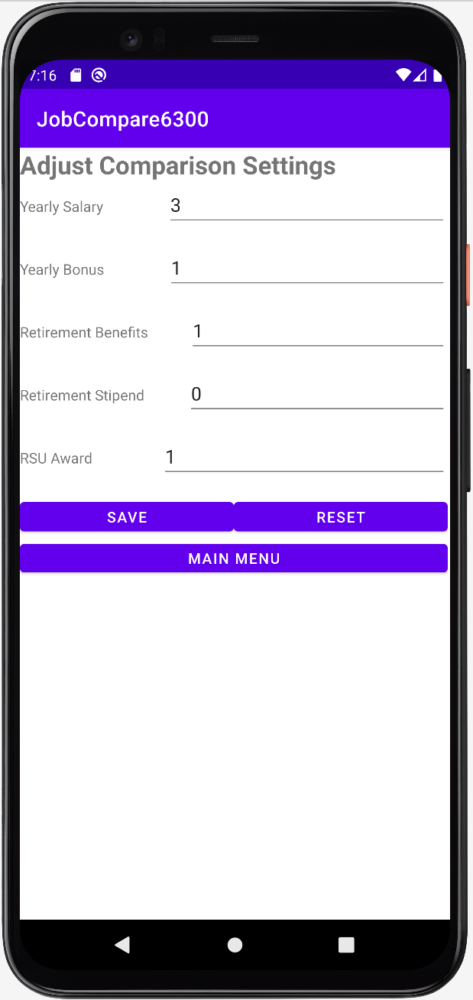
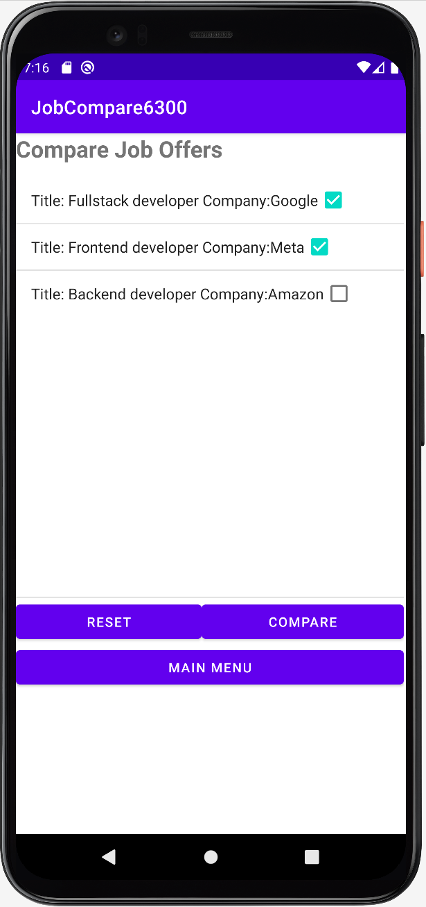
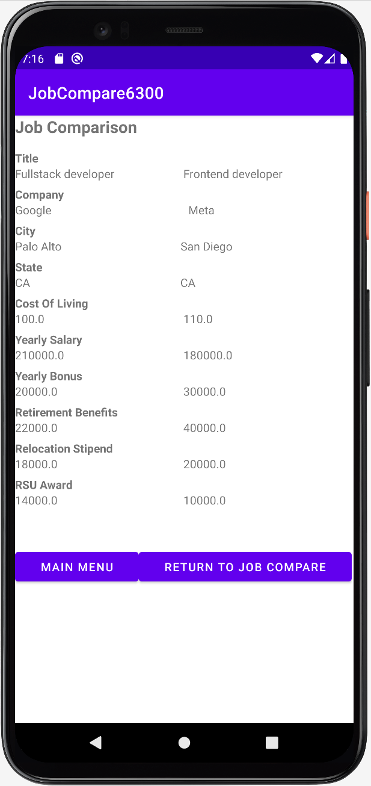

# User Manual of Job Comparison App

- [Introduction](#introduction)
- [Main Menu](#main-menu)
- [Enter/Edit Current Job Details](#enteredit-current-job-details)
- [Enter/Update/Compare Job Offers](#enterupdatecompare-job-offers)
- [Adjust Comparison Settings](#adjust-comparison-settings)
- [Compare Job Offers](#compare-job-offers)

## Introduction

This Job Comparison App enables you to make comparisons between your current job and new job offers, based on your preference weightings that can be customized on the comparison settings page.

## Main Menu

When the Job Comparison App is started, the main menu will be shown, there are 4 buttons provided:

1. `ENTER/EDIT CURRENT JOB DETAILS` -- You can enter and save details of your current job. Or if you saved your current job details before, the saved data will be shown, then you can edit and save the changes you have just made.
2. `ENTER/UPDATE/COMPARE JOB OFFERS` - You can enter and save details of your new job offers. Or if you saved any job offers before, you can search the saved job offer so that the saved data will be shown, then you can edit and update your job offer. Besides, if you saved your current job details before, then you can also make comparison between your current job and your new job offer.
3. `ADJUST COMPARISON SETTINGS` - You can edit the weightings assigned to five job attributes which contribute to the calculation of the job score in terms of a weighted average.
4. `COMPARE JOB OFFERS` - You will be presented a ranked list of jobs, including your current job and all job offers, in the decending order of the job scores. Then you can select two jobs so that their data will be placed side-by-side for your comparison.

*Remark: The `COMPARE JOB OFFERS` button will not be enabled if you did not save at least two jobs before (any two of your current job or job offers).*

## Enter/Edit Current Job Details

You can enter/edit your current job details, which include the following attributes:

* Title
* Company
* City
* State
* Cost of living
* Yearly salary
* Yearly bonus
* Retirement benefits
* Relocation stipend
* Restricted stock unit (RSU) award

There are 3 buttons provided on this page:

1. `SAVE`: Save the data entered on this page.
2. `RESET`: Reset all the data on this page to blank.
3. `MAIN MENU`: Go back to the main menu.

## Enter/Update/Compare Job Offers

You can enter/edit your new job offers details, which have the same attributes as the current job. After you have entered Title and Company, the app will first search for any job offers saved before, if there is a match, then the data of that job offer will be shown for you to make changes and update. Or else there is no match, then you have created a new job offer, so that you can enter the new data and save.

There are 5 buttons provided on this page:

1. `SAVE`: Save the data entered on this page.
2. `RESET`: Reset all the data on this page to blank
3. `MAIN MENU`: Go back to the main menu.
4. `COMPARE`: Once you have clicked the `SAVE` button, you can click this button to make a comparison of this job offer with the current job.
5. `SAVE & ENTER ANOTHER OFFER`: Save the data entered on this page for the job offer you are editing. Then reset all the data on this page to blank for you to enter another job offer.

*Remark: The `COMPARE` button will not be enabled if you did not clicked the `SAVE` button or if you did not save your current job details by `ENTER/EDIT CURRENT JOB DETAILS` before.*

## Adjust Comparison Settings

You can modify the weights allocated to the 5 job attributes below for calculating the job score in terms of a weighted average value. The job score will be used on the `COMPARE JOB OFFERS` page for ranking. By default, all the weights will be initially set to 1 when the app is first started. Please note only non-negative integers are allowed for the weights.

* Annual Salary
* Annual Bonus
* Retirement benefits
* Relocation stipend
* Restricted stock unit award

For instance, if you want to weight Annual Salary at three times the weight of any other factor, meanwhile you want to ignore Relocation Stipend, then you can set the weights as follows:

| Job Attribute               | Weight |
|-----------------------------|--------|
| Annual Salary               | 3      |
| Annual Bonus                | 1      |
| Retirement benefits         | 1      |
| Relocation stipend          | 0      |
| Restricted stock unit award | 1      |

There are 3 buttons provided on this page:

1. `SAVE`: Save the weights entered on this page.
2. `RESET`: Reset all the weights on this page to 1.
3. `MAIN MENU`: Go back to the main menu.

## Compare Job Offers

Once you have saved at least two jobs (no matter current job or job offers) before, you can enter this page. You will be presented a ranked list of all the jobs saved so far, ordered from the highest score to the lowest score from the top to the bottom. Then you can select two jobs from the list for comparison.

There are 3 buttons provided on this page:

1. `RESET`: Deactivate all selected jobs such that the screen is reset to no jobs being selected.
2. `COMPARE`: Once you have selected two jobs, you can click this button to make a comparison between these two jobs.
3. `MAIN MENU`: Go back to the main menu.

*Remark: The `COMPARE` button will not be enabled if you did not select two jobs.*

After you have selected two jobs and click `COMPARE`, you will be directed to this page. The job details of these two selected jobs will be shown to you side-by-side for your comparision.

There are 2 buttons provided on this page:

1. `MAIN MENU`: Go back to the main menu.
2. `RETURN TO JOB COMPARE`: Go back to the previous page of `COMPARE JOB OFFERS`, where you can re-select two new jobs to trigger another comparison.

 