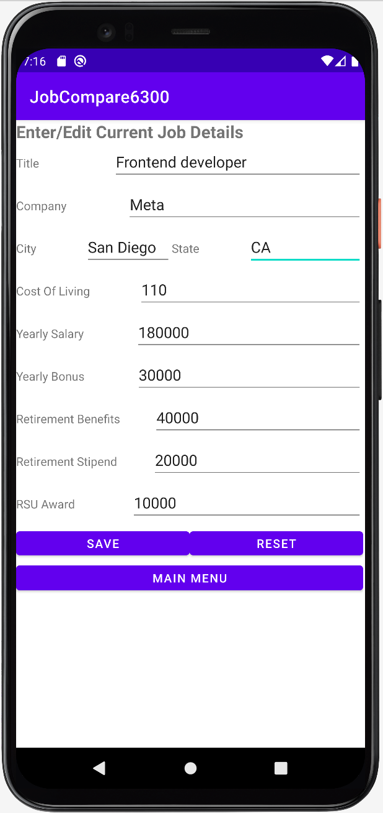
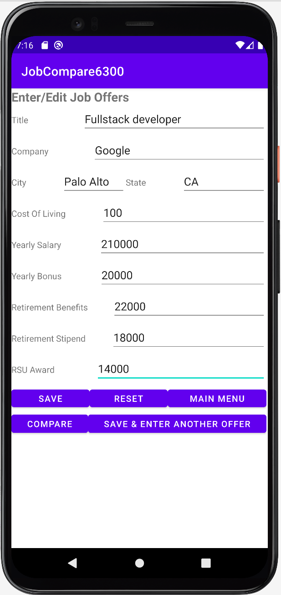

# User Manual of Job Comparison App

- [Introduction](#introduction)
- [Main Menu](#main-menu)
- [Enter/Edit Current Job Details](#enter/edit-current-job-details)
- [Enter/Update/Compare Job Offers](#enter/update/compare-job-offers)
- [Adjust Comparison Settings](#adjust-comparison-settings)
- [Compare Job Offers](#compare-job-offers)

## Introduction

This Job Comparison App enables you to make comparisons between your current job and new job offers, based on your preference weightings that can be customized in the comparison settings page.

## Main Menu

When you first launch the application, you'll have four options:

1. Current Job -- This allows you to enter data about your current job.  You'll be able to include your current job in your comparisons against job offers, so that you can also consider how your current postions compares with job offers.
2. New Job Offers - This will allow you to to add a new job offer.  
3. Settings - Here you will be able to configure your preference for how to weight various job attributes 
4. Compare Jobs - This will present you with a ranked list of jobs and allow you to compare jobs side-by-side.

*Note: the Compare Job button will be disabled if you do not have at least two job offers (or a current job and one job offer) to compare.*

## Enter/Edit Current Job Details

For your current job, you should enter the following details: 

* Title
* Company
* Location
* Yearly salary adjusted for cost of living
* Yearly bonus adjusted for cost of living
* Retirement benefits
* Relocation stipend
* Restricted stock unit award

## Enter/Update/Compare Job Offers

*Note: you will not be able to edit or remove these job offers after adding them. Make sure you have your details correct.*

For each new job offer, you will add this information:

* Title
* Company
* Location
* Yearly salary adjusted for cost of living
* Yearly bonus adjusted for cost of living
* Retirement benefits
* Relocation stipend
* Restricted stock unit award

## Adjust Comparison Settings

Our app provides an algorithm to rank job based on the data you enter -- but you have the option of weighting the various options.  Set non-negative integer weight for each of the fields below.  They will be weighted out of the sum of the integers you enter.

* Annual Salary
* Annual Bonus
* Retirement benefits
* Relocation stipend
* Restricted stock unit award

For example, if you wanted to weight the salary at twice the value of other factors, and you don't want to consider telework days at all, you might enter the following values:

| Attribute                   | Weight |
|-----------------------------|--------|
| Annual Salary               | 2      |
| Annual Bonus                | 1      |
| Retirement benefits         | 0      |
| Relocation stipend          | 1      |
| Restricted stock unit award | 1      |

## Compare Job Offers

In this screen, you will see a ranked list of job offers.  This ranking can be custom tailored to your preferences in the *Settings* screen.  The top of the list is the most highly ranked job opportunity.

If you wish to compare the details of two jobs, simply select two jobs and tap *Compare*.

 